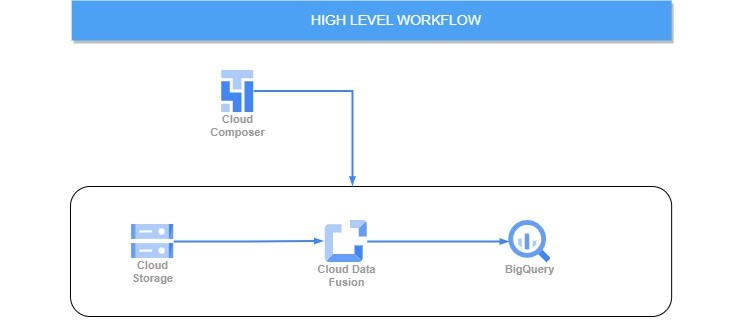
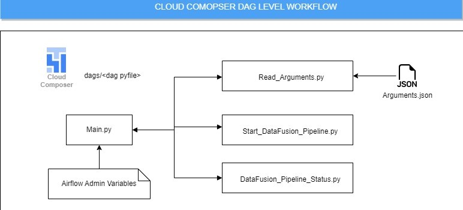

# Orchestrating Cloud DataFusion Pipeline using Cloud Composer


In this project, data pipeline was created in cloud Datafusion was triggered from cloud composer with passing all the  runtime arguments along with it.



## Code Workflow





1. Upload python files to dags folder, import airflow variables.json file to admin variables section, place the argument.json file in the gcs bucket.

2. main.py file is responsible for dag creation and pulls all the metadata information about the pipeline from airflow variables.

3. Read_Arguments.py is responsible for reading arguments.json file from GCS bucket.

4. Start_Datafusion_Pipeline.py is responsible for triggering Data pipeline in Cloud Data Fusion by passing all the runtime parameters required for data pipeline.

5. Datafusion_Pipeline_Status.py is responsible for monitoring status of the pipeline it will check pipeline status for every  30 secs till it returns Success or Failure State.

## Airflow Admin Variables

To run this project, you will need to add the following Airflow variables to admin Variables section.

    
    "bucket_name": "< GCS Bucket Name>",
    "file_name": "<Argument File Name>",
    "instance_name": "<Datafusion Instance Name>",
    "location": "<location>",
    "pipeline_name": "<Data Pipeline Name>",
    "project_id": "<Project Id>"

## Deployment

To deploy this project Upload all python files to dags folder of airflow, import airflow variables and place arguments file in GCS bucket.


## API Reference

#### Check out this link to learn more about managing Cloud Data Fusion apis.

```http
  https://cloud.google.com/data-fusion/docs/reference/cdap-reference
```


#### Check out this link to learn more about managing Aiflow apis.

```http
  https://airflow.apache.org/docs/apache-airflow-providers-google/stable/_api/airflow/providers/google/cloud/hooks/index.html
```


## Authors

- [maheshkt9899@gmail.com](https://github.com/MaheshPrime)

